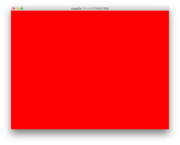
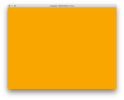
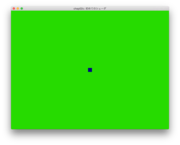
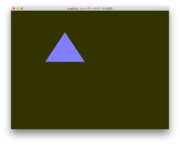
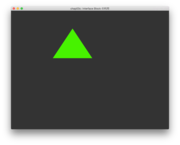
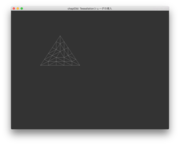
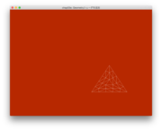
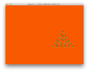
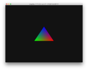
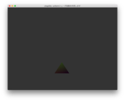

# Mavericks用のOpenGL SuperBibleサンプルコード

OpenGL SuperBible第6版で現代的なOpenGLを学び始めました．本を参考にMavericksでサンプルコードを作っています．ずぶの素人のやっていることなので，信頼性は？？？です．ちゃんと動いていないコードもあります．

# 準備

以下ではHomebrewが利用できること，したがってXcodeとそのコマンド行インタフェイスもインストールされていることを仮定しています．

有名な[GLUTによる「手抜き」OpenGL入門](http://www.wakayama-u.ac.jp/~tokoi/opengl/libglut.html)にしたがって[GLUT](https://www.opengl.org/resources/libraries/glut/)を使おうかと思ったのですが，Appleはあまり熱心にGLUTをサポートしなさそうな雰囲気なのでGLUTに替えてGLFW3を使っています．あまりわかっていないのですが，GLEW ([The OpenGL Extension Wrangler Library](http://glew.sourceforge.net))も利用しています．これらのほかにビルドシステムとしてCMakeを，行列を扱うための数学ライブラリとしてGLMを利用しています．いずれもHomebrewで簡単にインストールできます．

- CMakeのインストール．システム非依存のビルドツールとしてCMakeを使っています．今回がCMakeの使い始めです．不慣れなので，おかしい点が多々あると思います．

- GLFW3のインストール．Homebrewを通して，GLFW2とGLFW3という異なるバージョンをインストールすることができます．このような場合，homebrew/versions を tap してインストールします．

        brew tap homebrew/versions
        brew install glfw3

- GLEWのインストール

        brew install glew

- GLM ([OpenGL Mathematics](http://glm.g-truc.net/0.9.6/index.html))のインストール

        brew install glm

# ソースコード

- CMakeLists.txt: CMakeの設定

- [bin/init](bin/init): CMakeのプロジェクトを初期化するためのスクリプトです．私はこのGitプロジェクトはDropbox上に置き，CMakeのビルドはDropbox外のディレクトリ($HOME/projects/glfw)で行っているのですが，そのための設定です．

- [src/](src/): SuperBible に沿ったサンプルコード

- [src/test](src/test):
  [GLEW](src/test/glew.cpp),
  [GLFW](src/test/glfw.cpp),
  GLM ([glm.cpp](src/test/glm.cpp), [glm_sample.cpp](src/test/glm_sample.cpp))
  の簡単なサンプルコードです．

## 第二章: Our First OpenGL Program

 chap02a | chap02b | chap02c |
:-------:|:-------:|:-------:|
  |  | 

- [chap02a](src/chap02a.cpp): ウィンドウを消去します．

- [chap02b](src/chap02b.cpp): ウィンドウの消去色を変化させた簡単なアニメーションです．

- [chap02c](src/chap02c.cpp) ([VS](media/shaders/chap02c.vs), [FS](media/shaders/chap02c.fs)): シェーダを用いて点を描画します．

## 第三章: Following the Pipeline

 chap03a | chap03b | chap03c |
:-------:|:-------:|:-------:|:-------:|:-------:|:-------:|
  |  | 
 chap03d | chap03e | chap03f |
  |  | 

- [chap03a](src/chap03a.cpp) ([VS](media/shaders/chap03a.vs), [FS](media/shaders/chap03a.fs)): Vertex shaderとFragment shaderを利用した例．背景色が変化するなか，白い三角形が弧を描きます．

- [chap03b](src/chap03b.cpp) ([VS](media/shaders/chap03b.vs), [FS](media/shaders/chap03b.fs)): Vertex shaderを介してFragment shaderに三角形の色を与えることで色を変化させます．

- [chap03c](src/chap03c.cpp) ([VS](media/shaders/chap03c.vs), [FS](media/shaders/chap03c.fs)): Vertex shaderからFragment shaderへの値の伝達においてInterface Blockを利用しました．

- [chap03d](src/chap03d.cpp) ([VS](media/shaders/chap03d.vs), [TCS](media/shaders/chap03d.tcs), [TES](media/shaders/chap03d.tes), [FS](media/shaders/chap03d.fs)): Tessallation control shaderとTessallation evaluation shaderを追加し，三角形をワイヤーフレームで描画しています．

- [chap03e](src/chap03e.cpp) ([VS](media/shaders/chap03e.vs), [TCS](media/shaders/chap03e.tcs), [TES](media/shaders/chap03e.tes), [FS](media/shaders/chap03e.fs)): Geometry shaderを追加し，Tessell化した三角形の頂点を点描しています．

- [chap03f](src/chap03f.cpp) ([VS](media/shaders/chap03f.vs), [TCS](media/shaders/chap03f.tcs), [TES](media/shaders/chap03f.tes), [FS](media/shaders/chap03f.fs)): Fragment shaderでピクセルの位置に応じて色を決定することで三角形にグラデーションを与えます．

- [chap03g](src/chap03g.cpp) ([VS](media/shaders/chap03g.vs), [TCS](media/shaders/chap03g.tcs), [TES](media/shaders/chap03g.tes), [FS](media/shaders/chap03g.fs)): Fragment shaderへ与える色情報をVertex shaderを介してCPU側から与えようとした例だが，うまく動作しません．どうやらFragment ShaderにVertex shaderから与えているつもりの色情報が正しく届いていないようです．でも，原因は不明．

## 第四章: Math for 3D Graphics

- [chap04](src/chap04.cpp): この章は主に三次元グラフィックスに必要となる数学的基礎について紹介しています．ベクトルと行列，四元数，各種変換，補間，Bezier曲線，スプライン曲線など．このソースコードでは主にGLMのAPIで関連するものをテストしています．SuperBibleではvmathパッケージで記述されていたものをGLMに翻訳しました．

## 第五章: Data

 chap05a | chap05c 
:-------:|:-------:
 | 

- [chap05a](src/chap05a.cpp) ([VS](media/shaders/chap05a.vs), [FS](media/shaders/chap05a.fs)): 複数のデータをシェーダーに送る方法．Vertex Array Object と Vector Buffer Objectを連携させる方法．例題としては，三角形の形状と色の情報をアプリケーション側から送っています．

- [chap05b](src/chap05b.cpp) ([VS](media/shaders/chap05b.vs), [FS](media/shaders/chap05b.fs)): シェーダ側で複数の種類のデータに構造体でまとめあげた場合の，アプリケーション側からのデータを送る方法．できあがるのはchap05aと同じ例題のはずなんですが，vs-fs間に他のシェーダがあるときにデータの受け渡しがうまくいかなくなるようです．ただ，原因，究明中．

- [chap05c](src/chap05c.cpp) ([VS](media/shaders/chap05c.vs), [FS](media/shaders/chap05c.fs)): uniformを用いる方法．この例では，VSとFSにアプリ開始からの経過時間をuniformとして与えて，三角形の大きさと色みを変化させています．
